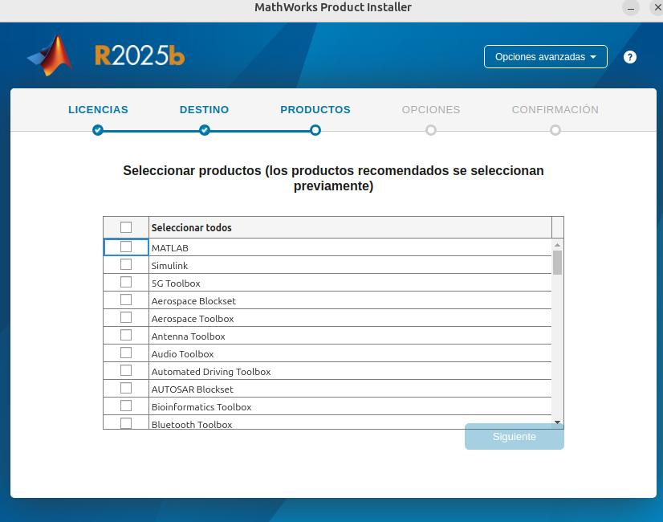

# Description
Integrate Matlab into Python

## Steps

- **STEP01**: Install Matlab

To use Matlab we must install first Matlab in our computer from the official [Matlab Portal](https://es.mathworks.com/downloads/web_downloads/). First read the [Matlab Python compatibility Table](https://es.mathworks.com/support/requirements/python-compatibility.html) to download the correct version of Matlab to be integrated in our Python version apps, in our case **matlab_R2025b_Linux.zip**. After download the zip file, unzip and execute the command:

```
$ sudo ./install
```

- **STEP02**: Problems at startuperror 5201

If we try to start or use Matlab in Python we will have errors with the MathWorks Service Host service. In Ubuntu 24.04 after install we will have some [problems](https://es.mathworks.com/matlabcentral/answers/1815395-why-do-i-receive-error-5201-unable-to-access-services-required-to-run-matlab) with the service MathWorks Service Host. This service validate the Matlab serial code, in our case as student. We must install some dependencies in Ubuntu before try to start or use Matlab in Python.


```
$ sudo apt install libcanberra-gtk-module libcanberra-gtk3-module ibatk-adaptor libgail-common
```

- **STEP03**: Install extra plugins

If we must use some extra plugins in Matlab. We can reexcute the command `install` and select new plugin in the step apropiated.



- **STEP04**: Integrate with Python

After install the previous dependencies we can start Matlab and integrate with Python. To use Matlab in Python we must install locally in out project the Python package called [matlabengine](https://pypi.org/project/matlabengine/). To be uses more info go to the [matlabengine project](https://github.com/mathworks/matlab-engine-for-python/)